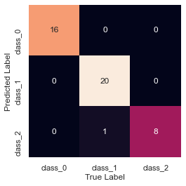
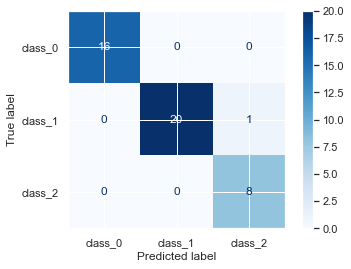

# K-Nearest Neighbors 

[](https://GitHub.com/Naereen/) 


### Import library required
Librari yang digunakan adalah **pandas, numpy, matplotlib, seaborn, dan sklearn**. Silahkan install terlebih dahulu jika belum menginstallnya dengan perintah `pip install nama-library`.


```python
%matplotlib inline
import pandas as pd
import numpy as np
import matplotlib.pyplot as plt
import seaborn as sns
sns.set()

from sklearn.datasets import load_wine
from sklearn.neighbors import KNeighborsClassifier
from sklearn.preprocessing import StandardScaler
from sklearn.model_selection import train_test_split
from sklearn.metrics import confusion_matrix
from sklearn.metrics import roc_curve, auc
```

### Load Data
Data yang digunakan adalah data bawaan sklearn library. Jika ingin menggunakan data sendiri silahkan pakai perintah `pd.read_csv()` atau `pd.read_excel()`


```python
data = load_wine(as_frame=True)
data.frame
```


<div>
<table border="1" class="dataframe">
  <thead>
    <tr style="text-align: right;">
      <th></th>
      <th>alcohol</th>
      <th>malic_acid</th>
      <th>ash</th>
      <th>alcalinity_of_ash</th>
      <th>magnesium</th>
      <th>total_phenols</th>
      <th>flavanoids</th>
      <th>nonflavanoid_phenols</th>
      <th>proanthocyanins</th>
      <th>color_intensity</th>
      <th>hue</th>
      <th>od280/od315_of_diluted_wines</th>
      <th>proline</th>
      <th>target</th>
    </tr>
  </thead>
  <tbody>
    <tr>
      <th>0</th>
      <td>14.23</td>
      <td>1.71</td>
      <td>2.43</td>
      <td>15.6</td>
      <td>127.0</td>
      <td>2.80</td>
      <td>3.06</td>
      <td>0.28</td>
      <td>2.29</td>
      <td>5.64</td>
      <td>1.04</td>
      <td>3.92</td>
      <td>1065.0</td>
      <td>0</td>
    </tr>
    <tr>
      <th>1</th>
      <td>13.20</td>
      <td>1.78</td>
      <td>2.14</td>
      <td>11.2</td>
      <td>100.0</td>
      <td>2.65</td>
      <td>2.76</td>
      <td>0.26</td>
      <td>1.28</td>
      <td>4.38</td>
      <td>1.05</td>
      <td>3.40</td>
      <td>1050.0</td>
      <td>0</td>
    </tr>
    <tr>
      <th>2</th>
      <td>13.16</td>
      <td>2.36</td>
      <td>2.67</td>
      <td>18.6</td>
      <td>101.0</td>
      <td>2.80</td>
      <td>3.24</td>
      <td>0.30</td>
      <td>2.81</td>
      <td>5.68</td>
      <td>1.03</td>
      <td>3.17</td>
      <td>1185.0</td>
      <td>0</td>
    </tr>
    <tr>
      <th>3</th>
      <td>14.37</td>
      <td>1.95</td>
      <td>2.50</td>
      <td>16.8</td>
      <td>113.0</td>
      <td>3.85</td>
      <td>3.49</td>
      <td>0.24</td>
      <td>2.18</td>
      <td>7.80</td>
      <td>0.86</td>
      <td>3.45</td>
      <td>1480.0</td>
      <td>0</td>
    </tr>
    <tr>
      <th>4</th>
      <td>13.24</td>
      <td>2.59</td>
      <td>2.87</td>
      <td>21.0</td>
      <td>118.0</td>
      <td>2.80</td>
      <td>2.69</td>
      <td>0.39</td>
      <td>1.82</td>
      <td>4.32</td>
      <td>1.04</td>
      <td>2.93</td>
      <td>735.0</td>
      <td>0</td>
    </tr>
    <tr>
      <th>...</th>
      <td>...</td>
      <td>...</td>
      <td>...</td>
      <td>...</td>
      <td>...</td>
      <td>...</td>
      <td>...</td>
      <td>...</td>
      <td>...</td>
      <td>...</td>
      <td>...</td>
      <td>...</td>
      <td>...</td>
      <td>...</td>
    </tr>
    <tr>
      <th>173</th>
      <td>13.71</td>
      <td>5.65</td>
      <td>2.45</td>
      <td>20.5</td>
      <td>95.0</td>
      <td>1.68</td>
      <td>0.61</td>
      <td>0.52</td>
      <td>1.06</td>
      <td>7.70</td>
      <td>0.64</td>
      <td>1.74</td>
      <td>740.0</td>
      <td>2</td>
    </tr>
    <tr>
      <th>174</th>
      <td>13.40</td>
      <td>3.91</td>
      <td>2.48</td>
      <td>23.0</td>
      <td>102.0</td>
      <td>1.80</td>
      <td>0.75</td>
      <td>0.43</td>
      <td>1.41</td>
      <td>7.30</td>
      <td>0.70</td>
      <td>1.56</td>
      <td>750.0</td>
      <td>2</td>
    </tr>
    <tr>
      <th>175</th>
      <td>13.27</td>
      <td>4.28</td>
      <td>2.26</td>
      <td>20.0</td>
      <td>120.0</td>
      <td>1.59</td>
      <td>0.69</td>
      <td>0.43</td>
      <td>1.35</td>
      <td>10.20</td>
      <td>0.59</td>
      <td>1.56</td>
      <td>835.0</td>
      <td>2</td>
    </tr>
    <tr>
      <th>176</th>
      <td>13.17</td>
      <td>2.59</td>
      <td>2.37</td>
      <td>20.0</td>
      <td>120.0</td>
      <td>1.65</td>
      <td>0.68</td>
      <td>0.53</td>
      <td>1.46</td>
      <td>9.30</td>
      <td>0.60</td>
      <td>1.62</td>
      <td>840.0</td>
      <td>2</td>
    </tr>
    <tr>
      <th>177</th>
      <td>14.13</td>
      <td>4.10</td>
      <td>2.74</td>
      <td>24.5</td>
      <td>96.0</td>
      <td>2.05</td>
      <td>0.76</td>
      <td>0.56</td>
      <td>1.35</td>
      <td>9.20</td>
      <td>0.61</td>
      <td>1.60</td>
      <td>560.0</td>
      <td>2</td>
    </tr>
  </tbody>
</table>
<p>178 rows × 14 columns</p>
</div>


### Split Data
Fungsi `train_test_split`, secara default akan membagi data menjadi 75% data training dan 25% data test. Untuk mengaturnya dapat menggunakan argument `test_size` atau `train_size`. Contoh `train_test_split(X, y, train_test = 0.8)`


```python
X_train, X_test, y_train, y_test = train_test_split(data.data, data.target, random_state=0)
print("Jumlah Training Data : ", len(X_train), " | Jumlah Test Data : ", len(X_test))
```

    Jumlah Training Data :  133  | Jumlah Test Data :  45
    

### Scale Features to Minimize Computation


```python
sc_X = StandardScaler()
X_train = sc_X.fit_transform(X_train)
X_test = sc_X.fit_transform(X_test)
```

### Make Model


```python
clf = KNeighborsClassifier(n_neighbors=11, p=2, metric='euclidean')
clf.fit(X_train, y_train)
clf.get_params()
```


    {'algorithm': 'auto',
     'leaf_size': 30,
     'metric': 'euclidean',
     'metric_params': None,
     'n_jobs': None,
     'n_neighbors': 11,
     'p': 2,
     'weights': 'uniform'}


### Predict Test Set with that Model


```python
y_pred = clf.predict(X_test)
y_pred
```


    array([0, 2, 1, 0, 1, 1, 0, 2, 1, 1, 2, 2, 0, 1, 2, 1, 0, 0, 2, 0, 1, 0,
           0, 1, 1, 1, 1, 1, 1, 2, 0, 0, 1, 0, 0, 0, 2, 1, 1, 2, 0, 0, 1, 1,
           1])


### Check Accuracy


```python
print('Accuracy: ', clf.score(X_test, y_test))
```

    Accuracy:  0.9777777777777777
    

### Make Confusion Matrix


```python
cm = confusion_matrix(y_test, y_pred)

plt.figure()
sns.heatmap(cm.T, annot=True, square=True, xticklabels=data.target_names, fmt='d',
           yticklabels=data.target_names, cbar=False)

plt.xlabel('True Label')
plt.ylabel('Predicted Label');
```





```python
from sklearn.metrics import plot_confusion_matrix
plot_confusion_matrix(clf, X_test, y_test, display_labels=data.target_names, cmap='Blues');
```




